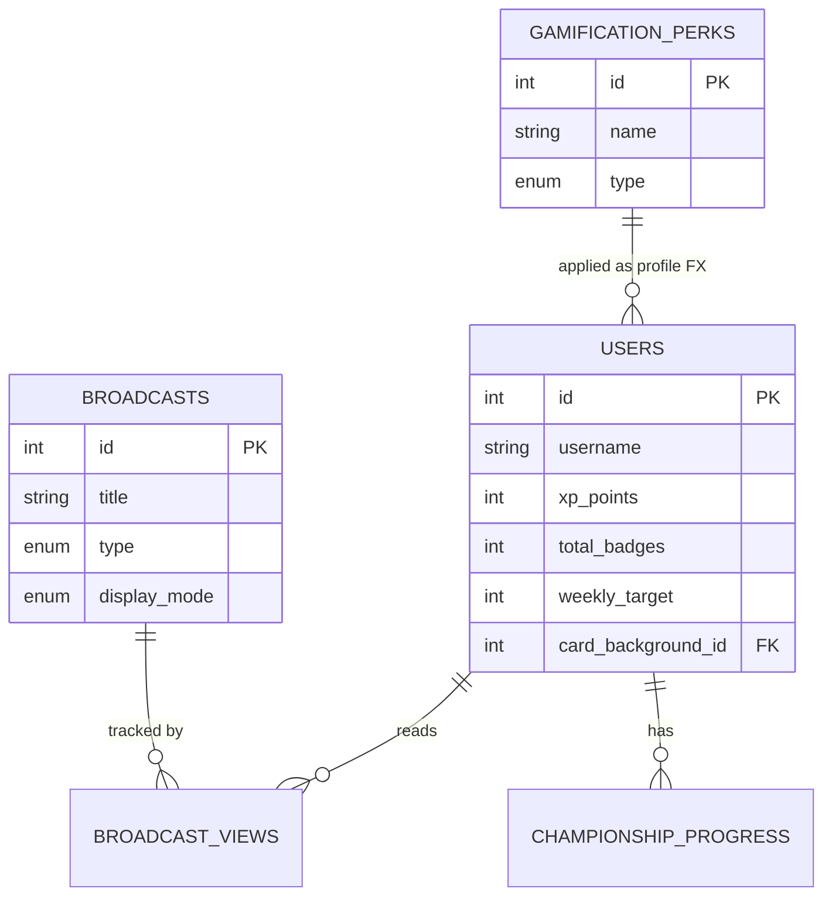

# 🗄 Basis Data & ERD

## 1. Teknologi Penyimpanan
Aplikasi menggunakan **MySQL** atau **MariaDB** sebagai basis data utama. Koneksi ke basis data (*Database Engine*) dikelola secara aman menggunakan ekstensi **PDO (PHP Data Objects)**.

## 2. Skema Relasi (ERD)
Aplikasi ini mendesain *relational model* tingkat lanjut khusus untuk mendukung sistem *e-learning* berbasis *gamification*.

## 3. Auto-Migration & Seeding Database
Sistem dilengkapi dengan skrip auto-bootstrapper di dalam `config/db.php`.

Setiap kali halaman aplikasi dimuat, *script* `ensureDatabaseBootstrap()` akan dipanggil. Fungsi ini akan:
1. Memeriksa keberadaan kolom baru (seperti `display_mode` pada tabel broadcasts, atau kolom kustomisasi profil pada tabel users).
2. Menjalankan perintah `ALTER TABLE` secara otomatis jika kolom tersebut belum ada (Migrasi Pasif).
3. Melakukan injeksi data *dummy* (*Seeding*) untuk mata pelajaran (Courses), Ujian (Exams), dan *Challenges* jika *database* masih dalam keadaan kosong.
